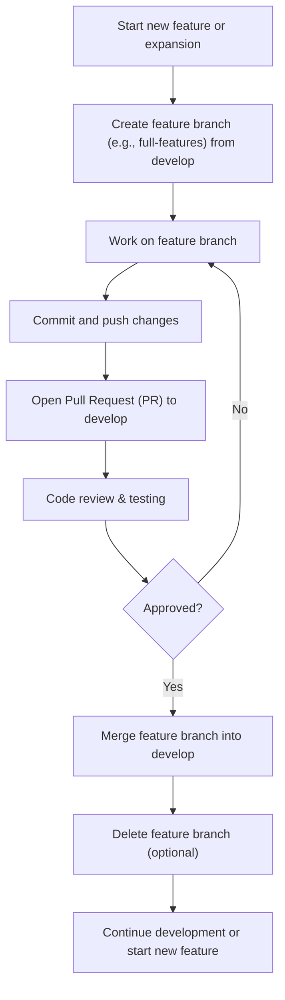

# Branching Workflow for Algebrini

This diagram illustrates the recommended git workflow for developing new features or major expansions:

## Steps
1. **Create a feature branch** from `develop` (e.g., `full-features`).
2. **Work on the feature branch** and commit changes.
3. **Push** the branch to the remote repository.
4. **Open a Pull Request (PR)** to merge into `develop`.
5. **Review and test** the changes.
6. **Merge** the branch into `develop` after approval.
7. **Delete** the feature branch (optional).

This workflow ensures stable development and easy collaboration. 